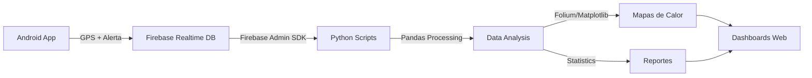
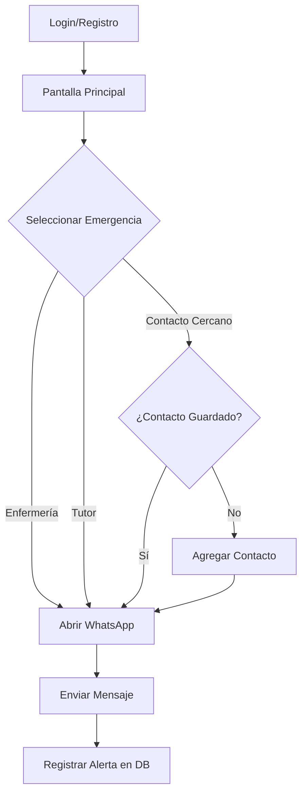

<div align="center">

# 🚨 Botón de Emergencia
### Sistema de Alerta Rápida por WhatsApp


</div>

---

## 📋 Descripción

**Botón de Emergencia** es una aplicación Android diseñada para enviar alertas de emergencia rápidas a través de WhatsApp **y recolectar datos geoespaciales en tiempo real para análisis de salud**. Con un solo toque, los usuarios pueden notificar a contactos predefinidos (enfermería, contacto cercano o tutor) sobre situaciones de emergencia, mientras que cada alerta se registra en Firebase con su ubicación GPS para posteriores análisis con Python y generación de mapas de calor.

### ✨ Características Principales

- 🔗 **Click-to-Chat**: Integración directa con WhatsApp usando `https://wa.me/`
- 📱 **Mensaje Pre-llenado**: `EMERGENCIA - [NUMERO_CONTROL] - Por favor comparte tu ubicación AHORA`
- 📍 **Geolocalización en Tiempo Real**: Captura automática de coordenadas GPS en cada alerta
- ☁️ **Almacenamiento en la Nube**: Firebase Realtime Database para recolección centralizada de datos
- 💾 **Registro Local**: SQLite como respaldo offline
- 🗺️ **Análisis Geoespacial**: Sistema Python para generar mapas de calor y análisis de zonas críticas
- 👥 **Gestión de Contactos**: Administración de contactos de emergencia por usuario
- 🔄 **Fallback Inteligente**: Detecta WhatsApp o WhatsApp Business, con chooser como respaldo

---

## 🛠️ Tecnologías Utilizadas

### Frontend (Android)
| Tecnología | Versión/Descripción | Propósito |
|------------|---------------------|-----------|-------|
| **Kotlin** | Language | Lógica principal de la aplicación |
| **Java** | Language | Helper de base de datos |
| **Android SDK** | API 24+ | Framework de desarrollo |
| **SQLite** | 3.x | Base de datos local (offline) |
| **Gradle** | 8.13 | Sistema de build |
| **JDK** | 11+ (probado con 21) | Compilación |
| **Material Design** | Components | UI/UX |

### Backend & Cloud
| Tecnología | Versión/Descripción | Propósito |
|------------|---------------------|-----------|-------|
| **Firebase Realtime Database** | 33.7.0 | Almacenamiento de alertas en la nube |
| **Firebase Analytics** | Latest | Métricas de uso |
| **Google Play Services Location** | Latest | Geolocalización precisa |

### Análisis de Datos (Python)
| Tecnología | Versión | Propósito |
|------------|---------|-----------|-------|
| **Python** | 3.10+ | Lenguaje base para análisis |
| **Firebase Admin SDK** | 6.5.0 | Acceso a datos de Firebase |
| **Pandas** | 2.2.0 | Procesamiento de datos |
| **Folium** | 0.15.1 | Generación de mapas interactivos |
| **Matplotlib/Seaborn** | Latest | Visualización estadística |
| **GeoPy** | 2.4.1 | Cálculos geoespaciales |

---

## 🏗️ Arquitectura del Proyecto

```
Boton_Emergencia/
├── app/
│   ├── src/
│   │   ├── main/
│   │   │   ├── java/com/example/boton_emergencia/
│   │   │   │   ├── db/
│   │   │   │   │   └── DbHelper.java          # 💾 Gestión SQLite (offline)
│   │   │   │   ├── models/
│   │   │   │   │   ├── AlertData.kt           # 📊 Modelo Firebase
│   │   │   │   │   └── Contact.kt             # 📦 Modelo de contactos
│   │   │   │   ├── EmergencyActivity.kt       # 🚨 Lógica principal + Firebase
│   │   │   │   ├── MainActivity.kt            # 🏠 Pantalla de login
│   │   │   │   ├── RegisterActivity.kt        # 📝 Registro de usuarios
│   │   │   │   ├── ContactListActivity.kt     # 📋 Lista de contactos
│   │   │   │   ├── ContactoActivity.kt        # ➕ Agregar contacto
│   │   │   │   └── PhoneUtils.kt              # 📞 Validación de números
│   │   │   └── res/
│   │   │       ├── layout/                    # 🎨 Interfaces XML
│   │   │       └── drawable/                  # 🖼️ Recursos gráficos
│   │   └── androidTest/                       # 🧪 Tests
│   ├── build.gradle.kts
│   └── google-services.json                   # 🔥 Config Firebase (NO COMMIT)
├── python_analysis/                           # 🐍 Sistema de análisis
│   ├── requirements.txt                       # 📦 Dependencias Python
│   ├── .env.example                           # 🔐 Template de configuración
│   ├── firebase_downloader.py                 # ⬇️ Descarga datos de Firebase
│   ├── heatmap_generator.py                   # 🗺️ Generador de mapas de calor
│   ├── data_analyzer.py                       # 📈 Análisis estadístico
│   ├── data_export/                           # 📁 Datos descargados (gitignored)
│   └── generated_maps/                        # 🖼️ Mapas generados (gitignored)
├── gradle/
├── .gitignore                                 # 🔒 Protección de datos sensibles
└── README.md
```

### 📐 Componentes Clave

#### Android App
| Componente | Responsabilidad |
|------------|-----------------|---------------|
| **EmergencyActivity** | Gestiona botones de emergencia, captura GPS, envío WhatsApp y sincronización Firebase |
| **AlertData** | Modelo de datos para Firebase con geolocalización y timestamp |
| **DbHelper** | CRUD de usuarios, contactos y alertas en SQLite (backup offline) |
| **PhoneUtils** | Normalización y validación de números telefónicos |
| **MainActivity** | Autenticación de usuarios |
| **ContactListActivity** | Administración de contactos de emergencia |

#### Python Analysis System
| Script | Responsabilidad |
|--------|-----------------|---------------|
| **firebase_downloader.py** | Descarga datos de alertas desde Firebase Realtime Database |
| **heatmap_generator.py** | Genera mapas de calor interactivos con Folium |
| **data_analyzer.py** | Análisis estadístico: frecuencia, zonas críticas, patrones temporales |

---

## 📊 Base de Datos (SQLite)

### Estructura de Tablas

#### 👤 **users**
| Columna | Tipo | Descripción |
|---------|------|-------------|
| `id` | INTEGER | PK, autoincrement |
| `control_number` | TEXT | Número de control único |
| `password_hash` | TEXT | Hash PBKDF2 |
| `salt` | TEXT | Salt para hashing |

#### 📇 **contacts**
| Columna | Tipo | Descripción |
|---------|------|-------------|
| `contact_id` | INTEGER | PK, autoincrement |
| `user_id` | INTEGER | FK a users |
| `phone` | TEXT | Número telefónico |
| `label` | TEXT | Etiqueta del contacto |
| `created_at` | TEXT | Timestamp |

#### 📢 **alerts**
| Columna | Tipo | Descripción |
|---------|------|-------------|
| `alert_id` | INTEGER | PK, autoincrement |
| `user_id` | INTEGER | FK a users |
| `contact_id` | INTEGER | FK a contacts (nullable) |
| `message` | TEXT | Mensaje enviado |
| `created_at` | TEXT | Timestamp |

---

## ☁️ Firebase Realtime Database

### Estructura de Datos

```json
{
  "alertas": {
    "push_id_1": {
      "controlNumber": "123456",
      "tipo": "atención médica urgente en enfermería",
      "latitud": 21.880633,
      "longitud": -102.293777,
      "fecha": "2026-01-31 14:35:22",
      "timestamp": 1738345522000
    },
    "push_id_2": {
      "controlNumber": "654321",
      "tipo": "ayuda a mi contacto cercano",
      "latitud": 21.882401,
      "longitud": -102.291055,
      "fecha": "2026-01-31 15:12:08",
      "timestamp": 1738347728000
    }
  }
}
```

### Campos de Alerta

| Campo | Tipo | Descripción | Uso en Análisis |
|-------|------|-------------|-----------------|---------------|
| `controlNumber` | String | Identificador del usuario | Anonimización, estadísticas por usuario |
| `tipo` | String | Categoría de emergencia | Clasificación de incidentes |
| `latitud` | Double | Coordenada GPS latitud | Mapas de calor, clustering |
| `longitud` | Double | Coordenada GPS longitud | Mapas de calor, clustering |
| `fecha` | String | Timestamp legible | Análisis temporal |
| `timestamp` | Long | Unix timestamp | Ordenamiento, series temporales |

---

## 🐍 Sistema de Análisis con Python

### Flujo de Datos



### Scripts Disponibles

#### 1. `firebase_downloader.py`
Descarga todos los datos de alertas desde Firebase y los exporta a CSV/JSON.

```bash
python firebase_downloader.py --output data_export/alertas.csv --format csv
```

#### 2. `heatmap_generator.py`
Genera mapas de calor interactivos basados en la concentración de alertas.

```bash
python heatmap_generator.py --input data_export/alertas.csv --output generated_maps/heatmap.html
```

**Características:**
- Mapas interactivos con Folium
- Capas por tipo de emergencia
- Clustering de zonas críticas
- Radio de influencia configurable

#### 3. `data_analyzer.py`
Realiza análisis estadístico avanzado.

```bash
python data_analyzer.py --input data_export/alertas.csv --report generated_maps/report.html
```

**Métricas generadas:**
- Frecuencia de alertas por hora/día/mes
- Top 10 zonas de mayor incidencia
- Distribución por tipo de emergencia
- Patrones temporales (horarios pico)
- Correlaciones geográficas

---

## ⚙️ Requisitos del Entorno de Desarrollo

| Requisito | Versión/Especificación |
|-----------|------------------------|
| **JDK** | 11+ (recomendado 17 o 21) |
| **Android SDK** | API Level 21+ (Android 5.0+) |
| **Build Tools** | 34.0.0+ |
| **Gradle** | 8.13 (incluido wrapper) |
| **IDE** | Android Studio Hedgehog o superior |
| **Dispositivo** | Físico con WhatsApp o emulador Google Play |

### Para Análisis Python

| Requisito | Versión/Especificación |
|-----------|------------------------|------------------------|-------|
| **Python** | 3.10+ |
| **pip** | Latest |
| **Cuenta Firebase** | Proyecto configurado con Realtime Database |
| **Credenciales Admin** | JSON de service account |

---

## 🚀 Instalación y Configuración

### 1️⃣ Configurar JDK (si Gradle falla con Java 8)

```powershell
# Establecer JAVA_HOME (PowerShell)
$env:JAVA_HOME = "C:\Program Files\Eclipse Adoptium\jdk-17.0.XX-hotspot"
$env:Path = "$env:JAVA_HOME\bin;$env:Path"

# Verificar versión
./gradlew --version
```

### 2️⃣ Build y Ejecución

#### Desde Terminal (Windows PowerShell)

```powershell
# 🔨 Compilar APK Debug
./gradlew assembleDebug

# 📦 Instalar en dispositivo conectado
./gradlew installDebug

# 🧹 Limpiar build anterior
./gradlew clean
```

#### Instalación Manual con ADB

```powershell
# Listar dispositivos conectados
adb devices

# Instalar APK generado
adb -s <device-id> install -r app\build\outputs\apk\debug\app-debug.apk
```

### 3️⃣ Configuración de Firebase

#### A. Obtener `google-services.json`

1. Ir a [Firebase Console](https://console.firebase.google.com/)
2. Crear proyecto o seleccionar existente
3. Agregar app Android con package name: `com.example.boton_emergencia`
4. Descargar `google-services.json`
5. Colocar en `app/google-services.json` (ya está en .gitignore)

#### B. Configurar Realtime Database

1. En Firebase Console → Realtime Database → Crear base de datos
2. Modo: **Modo de prueba** (para desarrollo)
3. Reglas temporales:

```json
{
  "rules": {
    "alertas": {
      ".read": "auth != null",
      ".write": true
    }
  }
}
```

⚠️ **PRODUCCIÓN**: Implementar reglas de seguridad estrictas

#### C. Obtener Credenciales Admin (para Python)

1. Firebase Console → Project Settings → Service Accounts
2. Click "Generate new private key"
3. Guardar como `python_analysis/firebase_credentials.json` (gitignored)

### 4️⃣ Configuración de Números de Emergencia

Editar constantes en `EmergencyActivity.kt`:

```kotlin
companion object {
    private const val ENFERMERIA_WHATSAPP = "+524493935203"
    private const val DEFAULT_CHATBOT_NUMBER = "521234567890"
}
```

### 5️⃣ Configuración del Entorno Python

```bash
# Navegar al directorio de análisis
cd python_analysis

# Crear entorno virtual
python -m venv venv

# Activar entorno (Windows)
.\venv\Scripts\activate

# Instalar dependencias
pip install -r requirements.txt

# Copiar configuración
cp .env.example .env

# Editar .env con tus valores
notepad .env
```

**Contenido de `.env`:**
```env
FIREBASE_CREDENTIALS_PATH=firebase_credentials.json
FIREBASE_DATABASE_URL=https://tu-proyecto.firebaseio.com
EXPORT_DIR=data_export
MAPS_DIR=generated_maps
```

---

## 📱 Uso de la Aplicación

### Flujo de Usuario



### Ejemplo de Mensaje Generado

```
EMERGENCIA - 123456 - Por favor comparte tu ubicación AHORA

Motivo: atención médica urgente en enfermería
Hora: 09:34 AM
```

---

## 🧪 Testing y Depuración

### Verificar Instalación de WhatsApp

```powershell
# Agregar platform-tools al PATH
$env:Path = "C:\Users\<user>\AppData\Local\Android\Sdk\platform-tools;$env:Path"

# Verificar paquetes instalados
adb shell pm list packages | findstr whatsapp
```

**Salida esperada:**
```
package:com.whatsapp
package:com.whatsapp.w4b  # WhatsApp Business (opcional)
```

### Recomendaciones de Prueba

| Escenario | Dispositivo | Resultado Esperado |
|-----------|-------------|-------------------|
| ✅ **Ideal** | Dispositivo físico con WhatsApp | Abre WhatsApp con mensaje pre-llenado |
| ⚠️ **Alternativo** | Emulador Google Play + WhatsApp | Funciona después de instalar WhatsApp |
| ❌ **Fallará** | Emulador sin Play Store | Toast "WhatsApp no está instalado" |

---

## ⚠️ Troubleshooting

### Problemas Comunes

<table>
<tr>
<th>❌ Problema</th>
<th>✅ Solución</th>
</tr>
<tr>
<td><strong>"WhatsApp no está instalado"</strong></td>
<td>
• Usar dispositivo físico con WhatsApp<br>
• Usar emulador con imagen Google Play<br>
• Verificar con <code>adb shell pm list packages</code>
</td>
</tr>
<tr>
<td><strong>Error de Gradle (Java 8)</strong></td>
<td>
• Actualizar <code>JAVA_HOME</code> a JDK 11+<br>
• <code>$env:JAVA_HOME="C:\...\jdk-17"</code><br>
• Reiniciar terminal
</td>
</tr>
<tr>
<td><strong>ADB no reconocido</strong></td>
<td>
• Agregar <code>platform-tools</code> al PATH<br>
• Ubicación típica: <code>%LOCALAPPDATA%\Android\Sdk\platform-tools</code>
</td>
</tr>
<tr>
<td><strong>Dispositivo no detectado</strong></td>
<td>
• Habilitar "Depuración USB" en el teléfono<br>
• Instalar drivers USB del fabricante<br>
• <code>adb devices</code> debe listar el dispositivo
</td>
</tr>
</table>

---

## 🔧 Personalización

### Modificar Plantilla de Mensaje

Editar función `buildAlertMessage()` en `EmergencyActivity.kt`:

```kotlin
private fun buildAlertMessage(reason: String?, currentTime: String): String {
    val controlDisplay = controlNumber?.takeIf { it.isNotBlank() } ?: "SIN_NUMERO_CONTROL"
    val header = "EMERGENCIA - $controlDisplay - Por favor comparte tu ubicación AHORA"
    val details = mutableListOf<String>()
    
    if (!reason.isNullOrBlank()) {
        details.add("Motivo: $reason")
    }
    details.add("Hora: $currentTime")
    
    return buildString {
        append(header)
        if (details.isNotEmpty()) {
            append("\n\n")
            append(details.joinToString("\n"))
        }
    }
}
```

---

## 🚀 Roadmap y Mejoras Futuras

- [ ] 📍 Compartir ubicación GPS automáticamente
- [ ] 🔔 Notificaciones push para confirmación de recepción
- [ ] 🌐 Soporte multi-idioma (español/inglés)
- [ ] 🎨 Temas personalizables (claro/oscuro)
- [ ] 📊 Dashboard con historial de alertas
- [ ] 🔐 Autenticación biométrica
- [ ] 📞 Integración con llamadas de emergencia (911)
- [ ] 💬 Soporte para otros servicios de mensajería (Telegram, SMS)

---

## 📄 Licencia

Este proyecto fue desarrollado como herramienta educativa. Para uso comercial, consulta con el autor.

---

## 👥 Contribuidores

- **Desarrollo Principal**: [jessusgarciar](https://github.com/jessusgarciar)
- **Repositorio**: [Boton_Emergencia_App](https://github.com/jessusgarciar/Boton_Emergencia_App)
