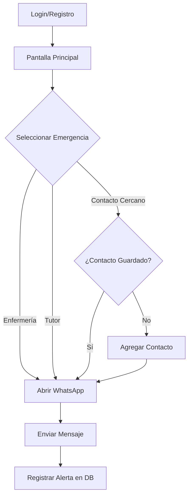

<div align="center">

# 🚨 Botón de Emergencia
### Sistema de Alerta Rápida por WhatsApp


</div>

---

## 📋 Descripción

**Botón de Emergencia** es una aplicación Android diseñada para enviar alertas de emergencia rápidas a través de WhatsApp. Con un solo toque, los usuarios pueden notificar a contactos predefinidos (enfermería, contacto cercano o tutor) sobre situaciones de emergencia.

### ✨ Características Principales

- 🔗 **Click-to-Chat**: Integración directa con WhatsApp usando `https://wa.me/`
- 📱 **Mensaje Pre-llenado**: `EMERGENCIA - [NUMERO_CONTROL] - Por favor comparte tu ubicación AHORA`
- 💾 **Registro Local**: Almacenamiento de alertas en base de datos SQLite
- 👥 **Gestión de Contactos**: Administración de contactos de emergencia por usuario
- 🔄 **Fallback Inteligente**: Detecta WhatsApp o WhatsApp Business, con chooser como respaldo

---

## 🛠️ Tecnologías Utilizadas

| Tecnología | Versión/Descripción | Propósito |
|------------|---------------------|-----------|
| **Kotlin** | Language | Lógica principal de la aplicación |
| **Java** | Language | Helper de base de datos |
| **Android SDK** | API 21+ | Framework de desarrollo |
| **SQLite** | 3.x | Base de datos local |
| **Gradle** | 8.13 | Sistema de build |
| **JDK** | 11+ (probado con 21) | Compilación |
| **Material Design** | Components | UI/UX |

---

## 🏗️ Arquitectura del Proyecto

```
Boton_Emergencia/
├── app/
│   ├── src/
│   │   ├── main/
│   │   │   ├── java/com/example/boton_emergencia/
│   │   │   │   ├── db/
│   │   │   │   │   └── DbHelper.java          # 💾 Gestión SQLite
│   │   │   │   ├── EmergencyActivity.kt       # 🚨 Lógica principal
│   │   │   │   ├── MainActivity.kt            # 🏠 Pantalla de login
│   │   │   │   ├── RegisterActivity.kt        # 📝 Registro de usuarios
│   │   │   │   ├── ContactListActivity.kt     # 📋 Lista de contactos
│   │   │   │   ├── ContactoActivity.kt        # ➕ Agregar contacto
│   │   │   │   ├── PhoneUtils.kt              # 📞 Validación de números
│   │   │   │   └── Contact.kt                 # 📦 Modelo de datos
│   │   │   └── res/
│   │   │       ├── layout/                    # 🎨 Interfaces XML
│   │   │       └── drawable/                  # 🖼️ Recursos gráficos
│   │   └── androidTest/                       # 🧪 Tests
│   └── build.gradle.kts
├── gradle/
└── README.md
```

### 📐 Componentes Clave

| Componente | Responsabilidad |
|------------|-----------------|
| **EmergencyActivity** | Gestiona botones de emergencia y envío de mensajes |
| **DbHelper** | CRUD de usuarios, contactos y alertas en SQLite |
| **PhoneUtils** | Normalización y validación de números telefónicos |
| **MainActivity** | Autenticación de usuarios |
| **ContactListActivity** | Administración de contactos de emergencia |

---

## 📊 Base de Datos (SQLite)

### Estructura de Tablas

#### 👤 **users**
| Columna | Tipo | Descripción |
|---------|------|-------------|
| `id` | INTEGER | PK, autoincrement |
| `control_number` | TEXT | Número de control único |
| `password_hash` | TEXT | Hash PBKDF2 |
| `salt` | TEXT | Salt para hashing |

#### 📇 **contacts**
| Columna | Tipo | Descripción |
|---------|------|-------------|
| `contact_id` | INTEGER | PK, autoincrement |
| `user_id` | INTEGER | FK a users |
| `phone` | TEXT | Número telefónico |
| `label` | TEXT | Etiqueta del contacto |
| `created_at` | TEXT | Timestamp |

#### 📢 **alerts**
| Columna | Tipo | Descripción |
|---------|------|-------------|
| `alert_id` | INTEGER | PK, autoincrement |
| `user_id` | INTEGER | FK a users |
| `contact_id` | INTEGER | FK a contacts (nullable) |
| `message` | TEXT | Mensaje enviado |
| `created_at` | TEXT | Timestamp |

---

## ⚙️ Requisitos del Entorno de Desarrollo

| Requisito | Versión/Especificación |
|-----------|------------------------|
| **JDK** | 11+ (recomendado 17 o 21) |
| **Android SDK** | API Level 21+ (Android 5.0+) |
| **Build Tools** | 34.0.0+ |
| **Gradle** | 8.13 (incluido wrapper) |
| **IDE** | Android Studio Hedgehog o superior |
| **Dispositivo** | Físico con WhatsApp o emulador Google Play |

---

## 🚀 Instalación y Configuración

### 1️⃣ Configurar JDK (si Gradle falla con Java 8)

```powershell
# Establecer JAVA_HOME (PowerShell)
$env:JAVA_HOME = "C:\Program Files\Eclipse Adoptium\jdk-17.0.XX-hotspot"
$env:Path = "$env:JAVA_HOME\bin;$env:Path"

# Verificar versión
./gradlew --version
```

### 2️⃣ Build y Ejecución

#### Desde Terminal (Windows PowerShell)

```powershell
# 🔨 Compilar APK Debug
./gradlew assembleDebug

# 📦 Instalar en dispositivo conectado
./gradlew installDebug

# 🧹 Limpiar build anterior
./gradlew clean
```

#### Instalación Manual con ADB

```powershell
# Listar dispositivos conectados
adb devices

# Instalar APK generado
adb -s <device-id> install -r app\build\outputs\apk\debug\app-debug.apk
```

### 3️⃣ Configuración de Números de Emergencia

Editar constantes en `EmergencyActivity.kt`:

```kotlin
companion object {
    private const val ENFERMERIA_WHATSAPP = "+521111111111"
    private const val DEFAULT_CHATBOT_NUMBER = "521234567890"
}
```

---

## 📱 Uso de la Aplicación

### Flujo de Usuario



### Ejemplo de Mensaje Generado

```
EMERGENCIA - 123456 - Por favor comparte tu ubicación AHORA

Motivo: atención médica urgente en enfermería
Hora: 09:34 AM
```

---

## 🧪 Testing y Depuración

### Verificar Instalación de WhatsApp

```powershell
# Agregar platform-tools al PATH
$env:Path = "C:\Users\<user>\AppData\Local\Android\Sdk\platform-tools;$env:Path"

# Verificar paquetes instalados
adb shell pm list packages | findstr whatsapp
```

**Salida esperada:**
```
package:com.whatsapp
package:com.whatsapp.w4b  # WhatsApp Business (opcional)
```

### Recomendaciones de Prueba

| Escenario | Dispositivo | Resultado Esperado |
|-----------|-------------|-------------------|
| ✅ **Ideal** | Dispositivo físico con WhatsApp | Abre WhatsApp con mensaje pre-llenado |
| ⚠️ **Alternativo** | Emulador Google Play + WhatsApp | Funciona después de instalar WhatsApp |
| ❌ **Fallará** | Emulador sin Play Store | Toast "WhatsApp no está instalado" |

---

## ⚠️ Troubleshooting

### Problemas Comunes

<table>
<tr>
<th>❌ Problema</th>
<th>✅ Solución</th>
</tr>
<tr>
<td><strong>"WhatsApp no está instalado"</strong></td>
<td>
• Usar dispositivo físico con WhatsApp<br>
• Usar emulador con imagen Google Play<br>
• Verificar con <code>adb shell pm list packages</code>
</td>
</tr>
<tr>
<td><strong>Error de Gradle (Java 8)</strong></td>
<td>
• Actualizar <code>JAVA_HOME</code> a JDK 11+<br>
• <code>$env:JAVA_HOME="C:\...\jdk-17"</code><br>
• Reiniciar terminal
</td>
</tr>
<tr>
<td><strong>ADB no reconocido</strong></td>
<td>
• Agregar <code>platform-tools</code> al PATH<br>
• Ubicación típica: <code>%LOCALAPPDATA%\Android\Sdk\platform-tools</code>
</td>
</tr>
<tr>
<td><strong>Dispositivo no detectado</strong></td>
<td>
• Habilitar "Depuración USB" en el teléfono<br>
• Instalar drivers USB del fabricante<br>
• <code>adb devices</code> debe listar el dispositivo
</td>
</tr>
</table>

---

## 🔧 Personalización

### Modificar Plantilla de Mensaje

Editar función `buildAlertMessage()` en `EmergencyActivity.kt`:

```kotlin
private fun buildAlertMessage(reason: String?, currentTime: String): String {
    val controlDisplay = controlNumber?.takeIf { it.isNotBlank() } ?: "SIN_NUMERO_CONTROL"
    val header = "EMERGENCIA - $controlDisplay - Por favor comparte tu ubicación AHORA"
    val details = mutableListOf<String>()
    
    if (!reason.isNullOrBlank()) {
        details.add("Motivo: $reason")
    }
    details.add("Hora: $currentTime")
    
    return buildString {
        append(header)
        if (details.isNotEmpty()) {
            append("\n\n")
            append(details.joinToString("\n"))
        }
    }
}
```

---

## 🚀 Roadmap y Mejoras Futuras

- [ ] 📍 Compartir ubicación GPS automáticamente
- [ ] 🔔 Notificaciones push para confirmación de recepción
- [ ] 🎨 Temas personalizables (claro/oscuro)
- [ ] 📊 Dashboard con historial de alertas
- [ ] 📞 Integración llamadas
- [ ] 💬 Soporte para otros servicios de mensajería (Telegram, SMS)

---

## 📄 Licencia

Este proyecto fue desarrollado como herramienta educativa. Para uso comercial, consulta con el autor.

---

## 👥 Contribuidores

- **Desarrollo Principal**: [jessusgarciar](https://github.com/jessusgarciar)
- **Repositorio**: [Boton_Emergencia_App](https://github.com/jessusgarciar/Boton_Emergencia_App)
